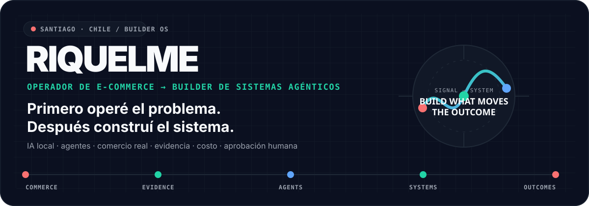
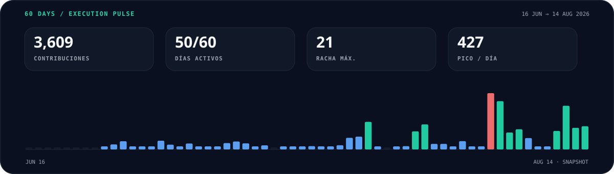
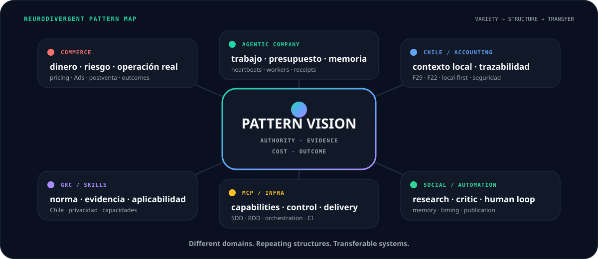
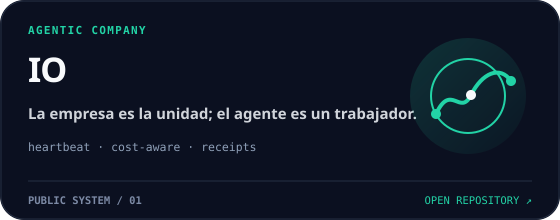
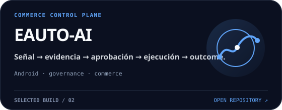
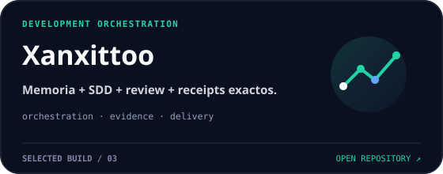
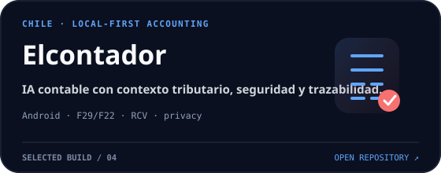
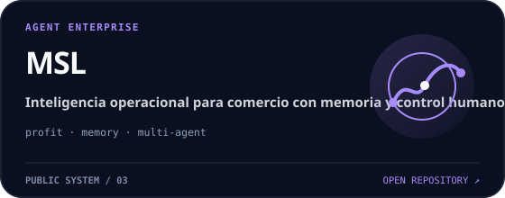
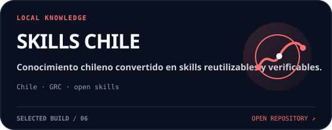
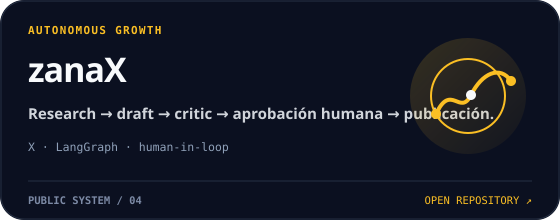

<p align="center">
  
</p>

<p align="center">
  <picture>
    <source media="(prefers-color-scheme: dark)" srcset="assets/profile/hero-dark.svg">
    <source media="(prefers-color-scheme: light)" srcset="assets/profile/hero-light.svg">
    
  </picture>
</p>

<p align="center">
  <a href="https://x.com/riquelme44127"></a>
  <a href="https://www.linkedin.com/in/sebastian-riquelme-vera-482778198"></a>
</p>

## No llegué al software desde el software.

Llegué desde la operación.

E-commerce real: catálogo, ventas, costos, publicidad, reclamos, proveedores y decisiones que mueven dinero. Empecé automatizando mi propio negocio; terminé construyendo sistemas donde la IA **no recibe autoridad por parecer inteligente**.

Hoy exploro una idea simple:

> **razonamiento probabilístico dentro de límites deterministas.**

Agentes con contexto, memoria y herramientas; pero también con presupuesto, evidencia, aprobación, idempotencia, verificación y outcomes. El objetivo no es tener más agentes. Es terminar mejor el trabajo.

<p align="center">
  <picture>
    <source media="(prefers-color-scheme: dark)" srcset="assets/profile/execution-pulse-dark.svg">
    <source media="(prefers-color-scheme: light)" srcset="assets/profile/execution-pulse-light.svg">
    
  </picture>
</p>

<sub><strong>Corte: 17-AGO-2026.</strong> GitHub registró <strong>3.933 contribuciones</strong> entre el 19-JUN y el 17-AGO: <strong>3.114 commits</strong>, 51 días activos, racha máxima de 21 días y un pico de 427 en un día. Métricas obtenidas directamente de GitHub para una ventana exacta de 60 días; no se exponen repositorios ni actividad privada.</sub>

---

## La variedad no es dispersión. Es búsqueda de estructura.

Soy **neurodivergente**. No lo uso como credencial ni como “superpoder”; es parte de cómo entiendo mi forma de trabajar. Tiendo a moverme entre dominios muy distintos, perseguir conexiones y reconocer estructuras que reaparecen con nombres diferentes.

Comercio, contabilidad chilena, regulación de datos, infraestructura, sistemas agénticos, automatización de contenido: desde afuera parecen mundos separados. Desde adentro suelen terminar haciendo las mismas preguntas:

> **¿Quién puede decidir? · ¿Qué evidencia lo prueba? · ¿Cuánto cuesta equivocarse? · ¿Cómo verificamos el outcome?**

<p align="center">
  <picture>
    <source media="(prefers-color-scheme: dark)" srcset="assets/profile/pattern-lattice-dark.svg">
    <source media="(prefers-color-scheme: light)" srcset="assets/profile/pattern-lattice-light.svg">
    
  </picture>
</p>

No construyo proyectos para acumular repositorios. Los construyo cuando un problema real me obliga a entender una capa nueva o cuando un patrón aprendido en un dominio puede resolver otro.

### Patrones que viajan entre proyectos

| Patrón | Donde apareció primero | Donde reaparece |
|---|---|---|
| **autoridad explícita antes de actuar** | operación comercial y dinero real | EAUTO-AI · MSL · Xanxittoo |
| **evidencia antes que confianza** | reclamos, costos, auditoría operacional | Elcontador · Skills Chile · RDD |
| **cero trabajo cuando no cambió nada** | costo de automatización 24/7 | IO y su heartbeat determinístico |
| **separar propuesta, ejecución y outcome** | comercio y postventa | agentes, MCP, workflows y receipts |
| **contexto local como requisito, no adorno** | operar en Chile | Elcontador · Skills Chile · comercio chileno |
| **humano en el loop donde el riesgo importa** | decisiones económicas | EAUTO-AI · MSL · zanaX |

---

## Sistemas seleccionados por la idea difícil que resuelven

No están aquí por ser públicos, privados, grandes o pequeños. Están porque cada uno representa una pregunta difícil distinta.

<p align="center">
  <a href="https://github.com/riquelmechile/io"></a>
  <a href="https://github.com/riquelmechile/EAUTO-AI"></a>
</p>

<p align="center">
  <a href="https://github.com/riquelmechile/xanxittoo"></a>
  <a href="https://github.com/riquelmechile/Elcontador"></a>
</p>

<p align="center">
  <a href="https://github.com/riquelmechile/Msl"></a>
  <a href="https://github.com/riquelmechile/Skills-Chile"></a>
</p>

<p align="center">
  <a href="https://github.com/riquelmechile/zanaX"></a>
</p>

### Siete proyectos, siete preguntas

| Sistema | Pregunta que persigue |
|---|---|
| **IO** | ¿Puede una empresa agéntica estar disponible 24/7 sin quemar tokens cuando no ocurre nada? |
| **EAUTO-AI** | ¿Cómo dar inteligencia a una operación comercial sin entregar autoridad ciega al modelo? |
| **Xanxittoo** | ¿Cómo convertir desarrollo con IA en un proceso persistente, especificado, revisable y verificable? |
| **Elcontador** | ¿Cómo llevar IA contable local-first a Chile sin sacrificar seguridad, trazabilidad ni contexto tributario? |
| **MSL** | ¿Cómo organizar una fuerza de trabajo agéntica orientada a rentabilidad y evidencia operacional? |
| **Skills Chile** | ¿Cómo transformar conocimiento normativo y procesos chilenos en capacidades reutilizables y verificables? |
| **zanaX** | ¿Cómo automatizar investigación y publicación manteniendo crítica, memoria y aprobación humana? |

---

## Qué estoy intentando demostrar

**01 · La IA puede operar sin convertirse en una caja negra.**  
Una propuesta no es una ejecución. Una ejecución no es un outcome. Un `200 OK` no es evidencia suficiente.

**02 · El costo también es arquitectura.**  
Un agente 24/7 no tiene por qué llamar al modelo 24/7. Si no ocurrió nada material, la decisión correcta puede costar cero tokens.

**03 · El mundo real es mejor benchmark que una demo.**  
Mis sistemas nacen de problemas que ya existen: comercio, rentabilidad, contabilidad, regulación chilena, infraestructura y automatización personal.

**04 · La transferencia de patrones vale más que una lista de tecnologías.**  
Una arquitectura se vuelve interesante cuando una idea aprendida resolviendo comercio termina mejorando un agente, una skill legal, un sistema contable o un proceso de desarrollo.

**05 · Chile no es un pie de página.**  
Construyo también para contexto local: normativa, procesos y herramientas que normalmente no llegan bien representados a los sistemas globales.

<details>
<summary><strong>Cómo construyo: SDD → TDD → RDD</strong></summary>

<br>

```text
explorar
  ↓
proponer
  ↓
especificar ──→ diseñar
       \        /
        \      /
         tareas
           ↓
      RED → GREEN → REFACTOR
           ↓
       verificar
           ↓
     receipt exacto
           ↓
        entregar
```

La especificación define qué debe ser verdad.  
Los tests prueban el comportamiento.  
El receipt prueba qué candidato exacto fue revisado.

La IA acelera el trabajo; **la evidencia conserva la autoridad**.

</details>

<details>
<summary><strong>Mi laboratorio completo</strong></summary>

<br>

Además de los sistemas destacados, exploro ecommerce propio, control de MercadoLibre, benchmarks de orquestación, MCPs, infraestructura, memoria persistente, IA local y automatizaciones personales. No todo necesita convertirse en “producto”; algunos repos existen para responder una pregunta técnica concreta y alimentar el siguiente sistema.

Lo que une el laboratorio no es un stack. Es una secuencia recurrente:

```text
problema real → patrón → sistema → evidencia → aprendizaje → patrón reutilizable
```

No presento prototipos como producción. Si algo está incompleto, prefiero que el repositorio lo diga.

</details>

---

<p align="center">
  <strong>Building verifiable systems by connecting patterns across domains.</strong><br>
  <sub>Operate first · find the pattern · automate second · verify always.</sub>
</p>

<p align="center">
  <a href="https://x.com/riquelme44127">X</a>
  ·
  <a href="https://www.linkedin.com/in/sebastian-riquelme-vera-482778198">LinkedIn</a>
  ·
  <a href="https://github.com/riquelmechile?tab=repositories">Repositorios</a>
</p>
